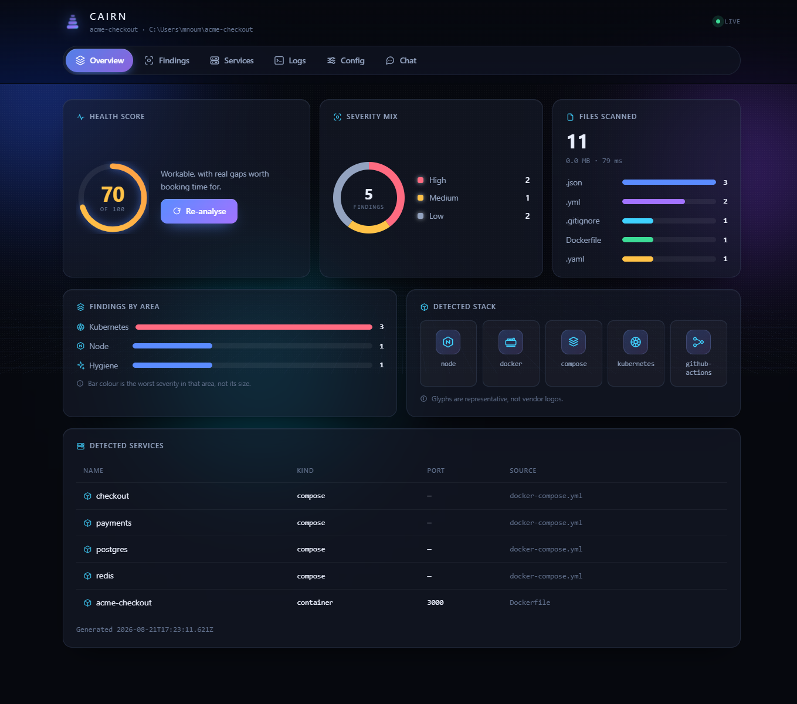
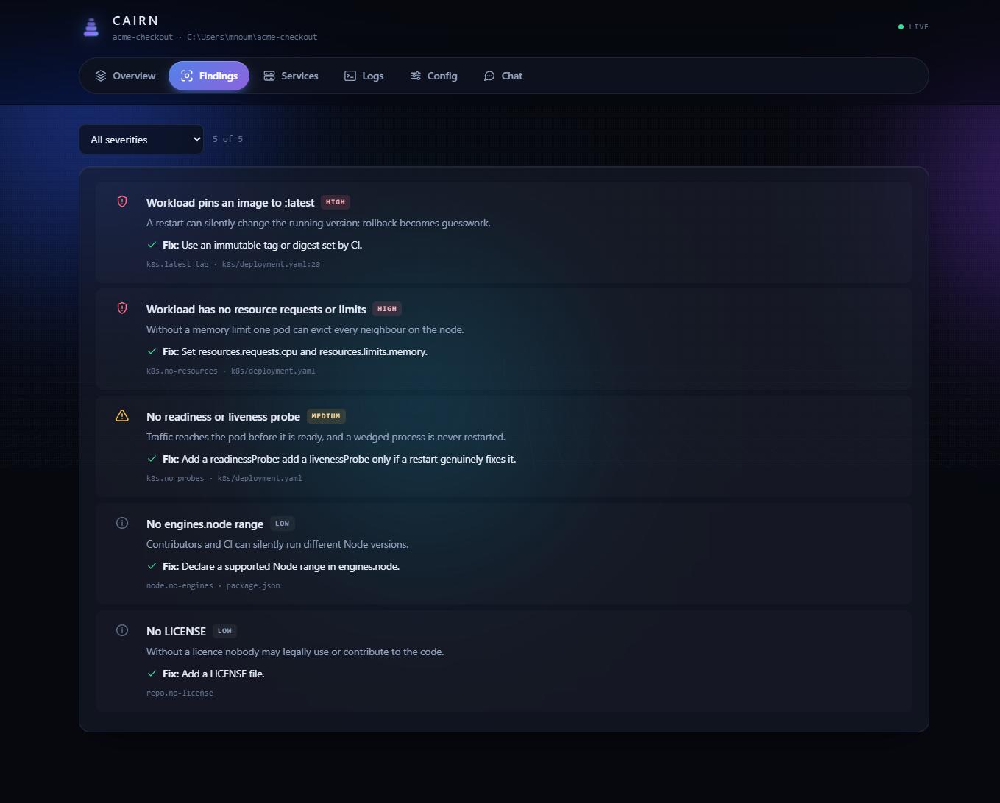
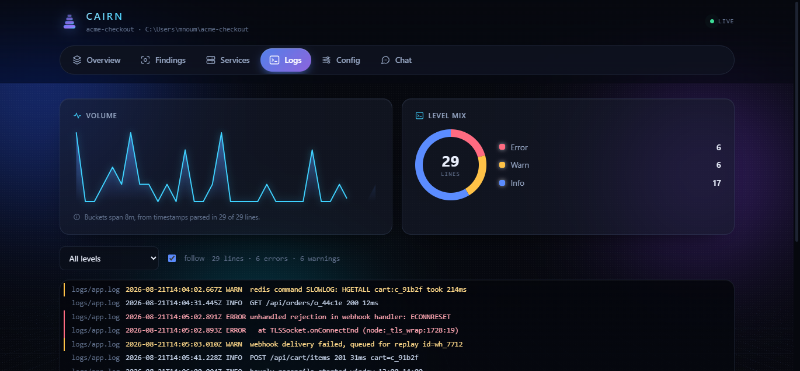
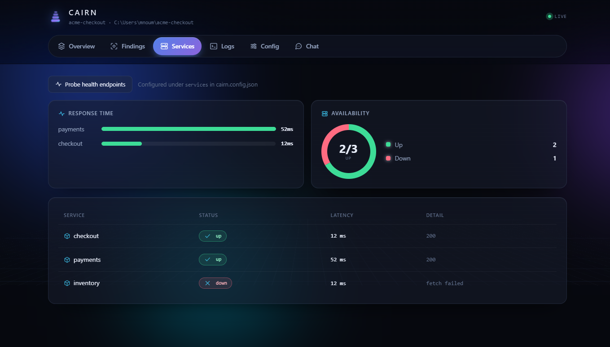
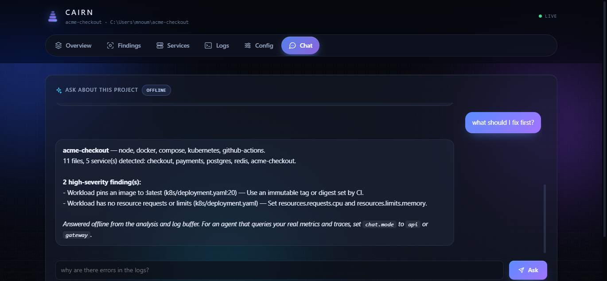

# Cairn

[](https://www.npmjs.com/package/@nouman-amjad/cairn)
[](https://github.com/Nouman-Amjad/Cairn/actions/workflows/ci.yml)
[](LICENSE)
[](https://nodejs.org)
[](npm/package.json)

An agentic incident-analysis copilot. Ask "why did checkout latency spike at
3am?" in plain English; Cairn queries the observability stack, correlates
against the deploy timeline, retrieves the relevant runbook, and proposes a
root cause with evidence — and can execute a remediation, behind a human
approval gate.

This repository implements [`docs/architecture.md`](docs/architecture.md).

## The dashboard

The companion npm package (`npx @nouman-amjad/cairn dashboard`) serves a live
local dashboard over any project — no build step, no dependencies, no network.



<details>
<summary>Findings, logs, services and chat</summary>









</details>

## The four commitments, and where they live in the code

| Commitment | Where it is enforced |
|---|---|
| **Tools are the product.** Every capability is an MCP tool; the agent has no privileged path to any backend. | [`services/cairn-mcp-*`](services/), [`packages/cairn-mcp-kit`](packages/cairn-mcp-kit/) |
| **Inference is a routed resource.** A cost-and-sensitivity router splits work between a local 8B and a frontier model. | [`routing.py`](services/cairn-router/src/cairn_router/routing.py) |
| **Write actions are never autonomous.** A durable approval state machine with idempotency keys and an append-only audit log. | [`service.py`](services/cairn-approval/src/cairn_approval/service.py) |
| **The eval harness is a first-class service.** 30 scenarios with ground-truth causes and 7 gated metrics. | [`services/cairn-eval`](services/cairn-eval/) |

## Layout

```
packages/
  cairn-core/          domain model, config, auth, DB, sensitivity, artifacts
  cairn-mcp-kit/       MCP scaffolding: identity, OPA guard, result capping, versioning
services/
  cairn-gateway/       OIDC, rate limits, cost budgets, circuit breaker, SSE fan-out
  cairn-orchestrator/  the agent loop as a state machine persisted to Postgres
  cairn-router/        model routing, cost accounting, vLLM + Anthropic clients
  cairn-approval/      approval state machine and the Slack gate
  cairn-mcp-observability/  metrics, logs, traces, deploys, artifacts
  cairn-mcp-runbooks/       hybrid search, ingest, past-incident recall
  cairn-mcp-actions/        approval-gated write tools
  cairn-eval/          30 scenarios, 7 metrics, the CI gate, a seeded stack
  cairn-cli/           `cairn ask "why did checkout spike?"`
ui/                    Next.js: chat, trajectory viewer, approvals
cairn-deploy/          Helm chart, ArgoCD app-of-apps, OPA bundle, prompts
cairn-infra/           Terraform: VPC, EKS, RDS, Karpenter, IRSA, S3
docker/                one Dockerfile for all Python services, plus vLLM
docs/adr/              14 architecture decision records
```

`cairn-deploy` and `cairn-infra` are vendored here for review. In production
they are separate repositories with separate lifecycles — see
[ADR-013](docs/adr/013-three-repos.md).

## Getting started

```bash
make install     # uv sync + npm ci
make up          # Postgres (pgvector), Redis, MinIO, OPA
make migrate
make test        # 246 tests
make selfcheck   # 21 module self-checks
make eval        # 30 scenarios through the real agent loop
```

No GPU and no API key are needed for any of the above. `make eval` runs in
heuristic mode, which exercises the whole pipeline — loop, tool capping,
persistence, the seven metrics, the gate — with a scripted stand-in instead of
a model. See [the caveats](#what-is-and-is-not-verified).

To run against real models, set `CAIRN_ROUTER_ANTHROPIC_API_KEY` and point
`CAIRN_ROUTER_VLLM_URL` at a vLLM server.

### Debugging with an MCP client

Every MCP server speaks stdio as well as Streamable HTTP:

```bash
make mcp-stdio
# or, the way an outside user would:
uvx cairn-mcp-observability --stdio
```

Point Cursor, Zed or any other MCP client at it and you see exactly what the agent sees.
That costs about twenty lines ([ADR-002](docs/adr/002-streamable-http-transport.md))
and pays for itself the first time a tool result looks nothing like you
expected.

## What is and is not verified

Being specific, because "it works" is not a claim worth making vaguely.

**Verified by running it here:**

- **246 tests** pass against a real PostgreSQL 16 + pgvector, including the
  approval-gate safety properties (no self-approval, no double execution, no
  execution without approval, an append-only audit log enforced by a database
  trigger) and the router property that restricted data never reaches a cloud
  model — checked exhaustively across every task class and tier state.
- **21 module self-checks** pass.
- The Alembic migration applies cleanly to a real database.
- **12/12 OPA policy tests** pass.
- The 30-scenario eval runs end to end through the real agent loop; all seven
  metrics are above target and the gate correctly blocks both a simulated
  regression and a below-target run.
- The UI typechecks and builds. The CLI's five commands resolve.

**Not verified here, and why:**

- **Eval accuracy numbers.** The committed baseline is heuristic mode, which
  scores the harness rather than the agent. Real numbers need `make eval-record`
  against a live router. The LLM cause judge is built but **not calibrated** —
  nobody has labelled 100 runs, so κ is unknown.
- **Terraform.** No `terraform` binary in this environment; `fmt`, `validate`
  and `tflint` run in CI. Nothing has been applied to an AWS account.
- **Helm rendering.** `helm lint`, `template` and `kubeconform` run in CI for
  all three environments. They were not run locally.
- **Every cost figure** in [`docs/cost.md`](docs/cost.md). The accounting that
  would measure them is built and tested; the traffic to populate it does not
  exist.
- **The vLLM performance table.** Arithmetic from memory bandwidth, not
  measurement. [`docs/inference.md`](docs/inference.md) gives the benchmark
  command and a falsification threshold.
- **Chaos testing.** Phase 7 of the roadmap has not been run.

[`docs/roadmap.md`](docs/roadmap.md) tracks this phase by phase.

## Documentation

- [`docs/architecture.md`](docs/architecture.md) — the design this implements
- [`docs/adr/`](docs/adr/) — 14 decision records, each with its consequence
- [`docs/security.md`](docs/security.md) — threat model and where each control lives
- [`docs/inference.md`](docs/inference.md) — GPU sizing, KV-cache arithmetic, vLLM flags
- [`docs/cost.md`](docs/cost.md) — the cost model, including whether the GPU pays for itself
- [`docs/operations.md`](docs/operations.md) — runbook: what pages, what to do
- [`docs/roadmap.md`](docs/roadmap.md) — phases, risks, and what is actually done
- [`services/cairn-eval/README.md`](services/cairn-eval/README.md) — how to read a gate failure
